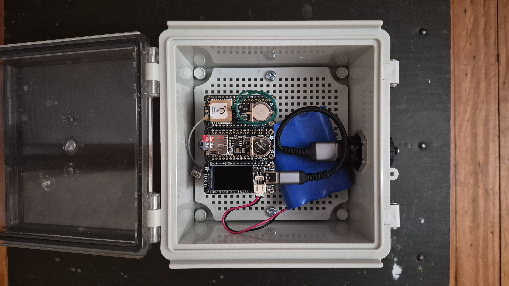

# rust_gps_ntp

Rust firmware for a GPS-disciplined NTP server on:

- Adafruit ESP32-S3 TFT Feather (default build target)
- Adafruit Ultimate GPS FeatherWing
- Adafruit adlogger FeatherWing



This repository includes project setup, hardware notes, and a flash workflow
for your connected board at `/dev/ttyACM0`.

## Requirements

- Follow [setup doc](docs/setup.md) for Rust + Espressif toolchain installation and flashing tools.

## Current Status

- ESP-IDF Rust project scaffold is in place (`build.rs`, target config, deps)
- Default target/chip is configured for ESP32-S3 (`xtensa-esp32s3-espidf`)
- M2: UART ingest + NMEA parse (`RMC`/`GGA`) with checksum validation + fix tracking
- Wi-Fi STA credentials load from build env (`WIFI_SSID`/`WIFI_PASS`)
- Boot initializes STA and logs acquired DHCP IP
- TFT display pages with button paging + 15s auto-blank
- Display pages: time/local estimate, position/satellites/PPS, resources, battery, NTP discipline
- PPS discipline on `GPIO12` (rising-edge interrupt)
- NTP UDP/123 responder with GPS/PPS-backed timestamps and mode-6 diagnostics
- IANA timezone lookup (background worker) with NVS cache
- [docs/rfp.md](docs/rfp.md) - project record: milestones, data model, test plan
## Rust code organization

Logic lives in the library crate (`src/lib.rs`); `src/main.rs` is a thin ESP-IDF
entrypoint. Modules include `gps`, `pps`, `ntp`, `display`, `battery`, `wifi`,
`timezone`, `logging`, and `app` (main loop orchestrator).

## Repo Layout

- `src/main.rs` - ESP32 firmware entrypoint
- `src/lib.rs` - shared modules and host-testable logic
- `.cargo/config.toml` - default target and flash runner
- `justfile` - development, CI, and flash commands
- `partitions.csv` - custom partition table with larger app partition
- [docs/setup.md](docs/setup.md) - one-time toolchain install and build/flash commands
- [docs/hardware.md](docs/hardware.md) - board pairing, wiring, and bring-up checklist
- [docs/rfp.md](docs/rfp.md) - implementation roadmap for GPS-disciplined NTP
- [docs/technical.md](docs/technical.md) - technical implementation: module design, data flow, NTP packet layout, external spec links
- [docs/rust-error-handling.md](docs/rust-error-handling.md) - project error-handling conventions (Result/Option/anyhow patterns)

## Quick Start

1. Follow [setup doc](docs/setup.md).
2. Flash and monitor:

```bash
just flash-monitor
```

## Validation testing

After the device is on the network with GPS/PPS lock, validate NTP accuracy from
another host on the LAN. Full usage, exit codes, and examples are documented in
the module docstring of [`scripts/validate_ntp.py`](scripts/validate_ntp.py).

Quick run (default device `gps-ntp`, three samples per host, ~60 s total to
respect the device's 2 s per-client rate limiter):

```bash
just validate-ntp
```

The script checks:

- device reachability and stratum 1
- leap indicator not unsynchronised (LI ≠ 3)
- offset divergence vs a median of reference servers (default tolerance 100 ms)

Exit codes (see script docstring for detail):

| Code | Meaning |
|---:|---|
| 0 | all checks passed |
| 1 | device offset exceeds `--tolerance` |
| 2 | device unreachable or invalid stratum |

Examples (also in [`scripts/validate_ntp.py`](scripts/validate_ntp.py)):

```bash
just validate-ntp gps-ntp.local
just validate-ntp 192.168.1.48 -- --tolerance 10
just validate-ntp gps-ntp -- --ref ntp.ubuntu.com
just validate-ntp gps-ntp -- --no-defaults --ref ntp.ubuntu.com --tolerance 50
```

For on-device integration checks (`ntpq`, holdover, rate limiting), see
[`docs/interop.md`](docs/interop.md). For sustained load testing after
validation, see [`docker/load/README.md`](docker/load/README.md).

## Accuracy

Example output from `just validate-ntp` against local and internet references:

| Host | Stratum | Ref | Delay ms | Offset ms |
|---|---|---|---:|---:|
| **gps-ntp** *(this device)* | 1 | GPS | 18.2 | +2.7 |
| 192.168.1.40 *(Pi3 + gpsd/ntpd)* | 1 | PPSH | 11.4 | +1.2 |
| time.nist.gov | 1 | NIST | 60.0 | +6.2 |
| time.google.com | 1 | GOOG | 42.9 | +10.2 |
| time.apple.com | 1 | GPSs | 60.9 | +14.4 |

gps-ntp is within **~1.5 ms of the local GPS-disciplined Pi reference** and
ahead of all internet stratum-1 servers on this LAN. Residual offset is at the
noise floor of single-shot UDP measurements over Wi-Fi (~RTT/2 ≈ ±5 ms per
sample).

## Development

see just recipes for details

```bash
just --list
just bench          # host Criterion benchmarks (GPS parse, NTP poll)
just load-test      # sustained on-device NTP load (see docker/load/ for multi-client)
just validate-ntp   # on-device accuracy validation (see Validation testing above)
```
